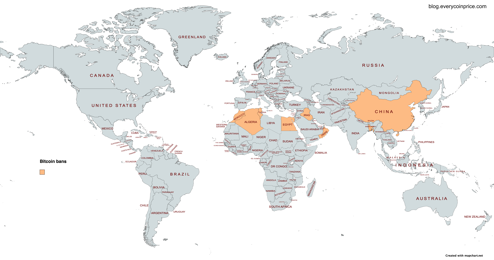
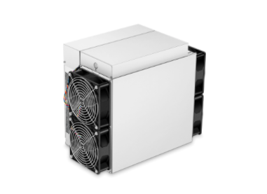

### What is Bitcoin?

Bitcoin is a peer to peer decentralized payment protocol that was established with the intention to remove third parties and their fees from online transactions between distant parties. 

Bitcoin's [whitepaper](https://bitcoin.org/bitcoin.pdf) clearly states this to be the only reason why [Satoshi Nakamoto](https://en.wikipedia.org/wiki/Satoshi_Nakamoto), founded it. He wanted to remove centralized bank and third parties from everyday online transactions and make them peer to peer using algorithms and a robust network of computers. The only feature that keeps the network running is computational power of all the 'nodes' or network of computers involved. They are responsible to validate transactions and keep the system 'intruder-proof'. The system is less susceptible to intrusion and mallice is because all the network of computers keeps a copy of all the transactions that happened since the beginning and checks each other copies to see they are all on the same page. In case of an anamoly, the computer(node) with the longest copy of transactions (blockchain - chain of blocks(a block is a transaction(s) copy)), is the one that is given the highest priority and becomes the ideal, because it has managed to keep itself fool-proof for the longest time. It is used to verify all transactions and keeps the system secure and it is the only reason why Bitcoin network has never been hacked from past 14 years and ongoing.

## Facts about Bitcoin

1. [Bitcoin is digital cash](#bitcoin-is-digital-cash)
2. [Bitcoin is decentralized payment system](#bitcoin-is-decentralized-payment-system)
3. [All transactions are Anonymous](#all-transactions-are-anonymous)
4. [Bitcoin is volatile](#bitcoin-is-volatile)
5. [Bitcoin reached its All Time High on 11 Nov 2021](#bitcoin-reached-its-all-time-high-on-11-nov-2021)
6. [Only 2% of addresses have 1 or more Bitcoins](#only-2%-of-addresses-have-1-or-more-bitcoins)
7. [Bitcoin network consumes lot of electricity](#bitcoin-network-consumes-lot-of-electricity)
8. [Satoshi Nakamoti hodls the maximum Bitcoins](#satoshi-nakamoti-hodls-the-maximum-bitcoins)
9. [1 Bitcoin = 100 millon Satoshis](#1-bitcoin-100-millon-satoshis)
10. [El Salvador is the first country to adopt Bitcoin as a legal tender](#el-salvador-is-the-first-country-to-adopt-bitcoin-as-a-legal-tender)
11. [As of 2022, two countries have Bitcoin as legal tender](#as-of-2022-two-countries-have-bitcoin-as-legal-tender)
12. [You can earn Bitcoin through Mining](#you-can-earn-bitcoin-through-mining)
13. [9 countries have banned Bitcoin (algeria, bangladesh, china, egypt, iraq, morocco, nepal, qatar, tunisia)](#9-countries-have-banned-bitcoin)
14. [Only 21 Million Bitcoin would ever be there](#only-21-million-bitcoin-would-ever-be-there)
15. [Bitcoin network has more computational power than the best supercomputer (80 mil vs 122.3 petaflops - Summit)](#bitcoin-network-has-more-computational-power-than-the-best-supercomputer)
16. [Satoshis are smaller units of Bitcoin](#satoshis-are-smaller-units-of-bitcoin)
17. [You can buy things with Bitcoin](#you-can-buy-things-with-bitcoin)
18. [10,000 Bitcoins were spent to buy pizza in 2010](#10000-bitcoins-were-spent-to-buy-pizza-in-2010)
19. [Keep your bitcoins in wallets or exchanges](#keep-your-bitcoins-in-wallets-or-exchanges)
20. [First version of Bitcoin was released in 2009 - Cryptography Mailing List, and on Jan. 9, 2009, Block 1 was mined, and Bitcoin mining commenced in earnest](#first-version-of-bitcoin-was-released-in-2009)
21. [Bitcoin rewards are halved every 210,000 blocks](#bitcoin-rewards-are-halved-every-210000-blocks)
22. [Bitcoin ledger is public](#bitcoin-ledger-is-public)
23. [There is no central storage. ledger is distributed](#there-is-no-central-storage-ledger-is-distributed)
24. [There is no central authority, managing it](#there-is-no-central-authority-managing-it)
25. [Anybody can create a new bitcoin address](#anybody-can-create-a-new-bitcoin-address)
26. [Anybody can initiate a transaction](#anybody-can-initiate-a-transaction)
27. [Issuance of new bitcoin is under no one's control](#issuance-of-new-bitcoin-is-under-no-ones-control)
28. [Anyone can become a miner](#anyone-can-become-a-miner)
29. [No government controls Bitcoin](#no-government-controls-bitcoin)
30. [Bitcoin.org domain was registered on 18 August, 2008](#bitcoinorg-domain-was-registered-on-18-august-2008)
31. [Bitcoin is open source](#bitcoin-is-open-source)
32. [First transaction was received by Hal Finney -  12 January 2009  10 btc](#first-transaction-was-received-by-hal-finney)
33. [Symbol for Bitcoin](#symbol-for-bitcoin)
34. [Term HODL is used for not selling](#term-hodl-is-used-for-not-selling)
35. [Satoshi, the original creator is unknown](#satoshi-the-original-creator-is-unknown)
36. [Official currency of Liberaland is Bitcoin](#official-currency-of-liberaland-is-bitcoin)
37. [Bitcoin uses more electricity than few countries](#bitcoin-uses-more-electricity-than-few-countries)
38. [Last Bitcoin will be mined in 2140](#last-bitcoin-will-be-mined-in-2140)
39. [In 2019, the first mortgage was taken using Bitcoin](#in-2019-the-first-mortgage-was-paid-in-bitcoin)
40. [BTC is the short form for Bitcoin](#btc-is-the-short-form-for-bitcoin)
41. [There are more than 50,000 Bitcoin millionaires](#there-are-more-than-50000-bitcoin-millionaires)
42. [You can buy a Bitcoin for less than $1](#you-can-buy-a-bitcoin-for-less-than-dollar1)
43. [20% of Bitcoin is lost forever](#20-of-bitcoin-is-lost-forever)
44. [You can buy and sell Bitcoin at ATMs](#you-can-buy-and-sell-bitcoin-at-atms)
45. [Bitcoin is digital money](#bitcoin-is-digital-money)
46. [Anyone can be part of Bitcoin development](#anyone-can-be-part-of-bitcoin-development)
47. [One man wants to excavate a landfill to find lost Bitcoins](#one-man-wants-to-excavate-a-landfill-to-find-lost-bitcoins)
48. [Bitcoin profits are taxed at some places](#bitcoin-profits-are-taxed-at-some-places)
49. [Bitcoin could be stored in offline wallets](#bitcoin-could-be-stored-in-offline-wallets)
50. [You can trade bitcoin without an exchange](#you-can-trade-bitcoin-without-an-exchange)
51. [Bitcoin miners have massive electricity spenditure](#bitcoin-miners-have-massive-electricity-spenditure)
52. [Some countries don't tax bitcoin yet](#some-countries-dont-tax-bitcoin-yet)
53. [Top 10 Crypto countries are not what you expect](#top-10-crypto-countries-are-not-what-you-expect)
54. [Top 5 countries ranked based on Crypto Adoption](#top-5-countries-ranked-based-on-crypto-adoption)
55. [Bitcoin market cap dominance is at 42%](#bitcoin-market-cap-dominance-is-at-42)
56. [Top bitcoin twitter accounts to follow](#top-bitcoin-twitter-accounts-to-follow)
57. [Only 5 addresses hodls the most Bitcoins](#only-5-addresses-hodls-the-most-bitcoins)
58. [Vancouver installed the worlds first Bitcoin ATM](#vancouver-installed-the-worlds-first-bitcoin-atm)
59. [Before 2010, you could mine Bitcoin on your laptop](#before-2010-you-could-mine-bitcoin-on-your-laptop)
60. [The Bitcoin network processes more than 270,000 transactions per day](#the-bitcoin-network-processes-more-than-270000-transactions-per-day)
61. [A kid won 127 BTC by completing surveys in 2011](#a-kid-won-127-btc-by-completing-surveys-in-2011)
62. [ASIC machines are used to mine Bitcoin in 2022](#asic-machines-are-used-to-mine-bitcoin-in-2022)
63. [China leads in Bitcoin mining](#china-leads-in-bitcoin-mining)
64. [Top 5 Bitcoin exchanges](#top-5-bitcoin-exchanges)
65. [Yougest bitcoin millionaire](#yougest-bitcoin-millionaire)
66. [Bitcoin notes doesnot exists](#bitcoin-notes-doesnot-exists)
67. [Leading fiat currencies to be exchanged for BTC](#leading-fiat-currencies-to-be-exchanged-for-btc)
68. [Top merchants accepting Bitcoin](#top-merchants-accepting-bitcoin)
69. [Lowest recorded BTC price](#lowest-recorded-btc-price)
70. [Most of Bitcoin wallets are inactive](#most-of-bitcoin-wallets-are-inactive)
71. [Bitcoin interest peaked in 2017](#bitcoin-interest-peaked-in-2017)
72. [Bitcoin nodes are on every continent](#bitcoin-nodes-are-on-every-continent)
73. [United states runs the maximum number of nodes](#united-states-runs-the-maximum-number-of-nodes)
74. [90% Bitcoin has been mined](#90-bitcoin-has-been-mined)
75. [Bitcoin market cap hit $1 Trillion twice](#bitcoin-market-cap-hit-dollar1-trillion-twice)
76. [Moving Bitcoin's price by 1%](#moving-bitcoins-price-by-1)
77. [89% of Bitcoin ATMs are in US](#89-of-bitcoin-atms-are-in-us)
78. [Notable people who get paid in Bitcoin](#notable-people-who-get-paid-in-bitcoin)
79. [Number of lines of code for Bitcoin](#number-of-lines-of-code-for-bitcoin)
80. [Copies of Bitcoin's code](#copies-of-bitcoins-code)
81. [Bitcoin has been sent to space](#bitcoin-has-been-sent-to-space)
82. [FBI seized 144,000 Bitcoins in 2013](#fbi-seized-144000-bitcoins-in-2013)
83. [Bitcoin fails as a currency](#bitcoin-fails-as-a-currency)
84. [Transaction cannot be reversed](#transaction-cannot-be-reversed)
85. [Bitcoin transactions are cost very less](#bitcoin-transactions-are-cost-very-less)
86. [Top Bitcoin debit cards](#top-bitcoin-debit-cards)
87. [You can earn bitcoin playing games](#you-can-earn-bitcoin-playing-games)
88. [These two survived on Bitcoin for 90 days](#these-two-survived-on-bitcoin-for-90-days)
89. [Tax exemption in Belgium](#tax-exemption-in-belgium)
90. [Switzerland stance on Bitcoin](#switzerland-stance-on-bitcoin)
91. [A man accepted Bitcoin in exchange of his house](#a-man-accepted-bitcoin-in-exchange-of-his-house)
92. [Private keys are the only access to Bitcoins](#private-keys-are-the-only-access-to-bitcoins)
93. [Satoshi was nominated for Nobel prize in Economics](#satoshi-was-nominated-for-nobel-prize-in-economics)
94. [Monument for Bitcoin](#monument-for-bitcoin)
95. [Statue of Satoshi Nakamoto](#statue-of-satoshi-nakamoto)
96. [Three types of Bitcoin addresses](#three-types-of-bitcoin-addresses)
97. [A kid named after "Bitcoin"](#a-kid-named-after-bitcoin)
98. [A physical Bitcoin sent to the moon](#a-physical-bitcoin-sent-to-the-moon)
99. [Fastest asset to hit $1 Trillion](#fastest-asset-to-hit-dollar1-trillion)
100. [Pay taxes using Bitcoin](#pay-taxes-using-bitcoin)

## Bitcoin is digital cash

[Credit](https://unsplash.com/@thoughtcatalog)

Bitcoin has value in the digital space and could be used to purchase and sell items. It is similar to physical cash, just that it is only stored online but could be used both online and offline.

## Bitcoin is decentralized payment system

Bitcoin is used for payment between individuals or organizations without the need of a central authority managing and controlling transactions. The trust needed to perform these transactions is built into the system using algorithms that keeps the system fool-proof.

## All transactions are Anonymous

All transactions in the Bitcoin network ledger are public yet anonymous. No one knows the exact name of person or parties that initiated the transactions and are receiving the value as listed in the transactions. 

## Bitcoin is volatile

Bitcoin is volatile and it's price is constatly changing based on the demand and supply. This is similar to how stocks are priced in a stock market environment.

## Bitcoin reached its All Time High on 11 Nov 2021

Bitcoin reached its all time high of $68.692.14 on 11 November in 2021. 

## Only 2% of addresses have 1 or more Bitcoins

There are 633,008 addresses that have at least 1 BTC (1.68 million coins in total), which is 2.18% of all addresses out there

## Bitcoin network consumes lot of electricity

Bitcoin currently consumes an estimated 150 terawatt-hours of electricity annually — more than the entire country of Argentina, population 45 million

## Satoshi Nakamoti hodls the maximum Bitcoins

Satoshi mined more than 22,000 blocks and received more than one million bitcoin in cumulative block rewards for his work. As a result, Satoshi is estimated to hold the largest bitcoin cache, more than 1 million BTC

## 1 Bitcoin = 100 millon Satoshis

[Source](https://en.bitcoinwiki.org/wiki/Satoshi)

There are 100 million satoshis (sats) in one bitcoin, meaning each satoshi is worth 0.00000001 BTC.

## El Salvador is the first country to adopt Bitcoin as a legal tender

Yuri Cortez/AFP via Getty Images

El Salvador this month became the first country to adopt a cryptocurrency – in this case, bitcoin – as a legal tender on September 7, 2021

## As of 2022, two countries have Bitcoin as legal tender

In April- 2022, The Central African Republic has become the second country in the world to adopt bitcoin as official currency, after El Salvador took the same step last year

## You can earn Bitcoin through Mining

1 When bitcoin was first mined in 2009, mining one block would earn you 50 BTC. In 2012, this was halved to 25 BTC. By 2016, this was halved again to 12.5 BTC. On May 11, 2020, the reward halved again to 6.25 BTC

## 9 countries have banned Bitcoin

Egypt, Iraq, Qatar, Oman, Morocco, Algeria, Tunisia, Bangladesh, and China have all banned cryptocurrency

## Only 21 Million Bitcoin would ever be there

There will be only 21 million bitcoins in existence, and to ensure a steady flow of liquidity, the coins will be minted at a fixed rate. New bitcoins only enter circulation when a new block is mined

## Bitcoin network has more computational power than the best supercomputer

The network of computers mining bitcoin is 8 times more powerful than the top 500 supercomputers. The bitcoin network also qualifies as the world's first exascale computer, meaning it's capable of a quintillion floating point calculations per second.

## Satoshis are smaller units of Bitcoin

A satoshi is the smallest denomination of bitcoin, equivalent to 100 millionth of a bitcoin. It is named to honour the unknown  invenetor of Bitcoin- Satoshi Nakamoto

## You can buy things with Bitcoin

The list of goods and services you can buy with bitcoin and other cryptocurrencies grows daily as people and vendors get more comfortable with virtual money. Insurance, consumer staples, luxury watches, and event tickets are among the items that Bitcoin could buy. You can search for items to buy using Bitcoin on [Spendabit](https://spendabit.co/)

## 10,000 Bitcoins were spent to buy pizza in 2010

In 2010, Laszlo Hanyecz spent 10,000 Bitcoins at a local pizza restaurant called Papa John's to buy himself two pizzas. Back then his Bitcoins were worth only $40

## Keep your bitcoins in wallets or exchanges

You can store your Bitcoins is a digital wallet or keep it at an exchange like Binance, Gate.io or Cex.io. Keeping Bitcoins in a digital wallet requires you to handle your private and public keys yourself and thus it is more secure, while an exchange handles all of this for you, in exchange all the bitcoins you hold on an exchange are virtually owned by the exchange, similar to how a bank operates.

## First version of Bitcoin was released in 2009

On Jan. 8, 2009, the first version of the Bitcoin software was announced to the Cryptography Mailing List, and on Jan. 9, 2009, Block 1 was mined, and Bitcoin mining commenced in earnest.

## Bitcoin mining rewards are halved every 210,000 blocks

After every 210,000 blocks mined, or roughly every four years, the block reward given to Bitcoin miners for processing transactions is cut in half. This event is referred to as halving because it cuts in half the rate at which new bitcoins are released into circulation

## Bitcoin ledger is public

A cryptocurrency public ledger is a record-keeping system. The ledger maintains participants' identities anonymously, their respective cryptocurrency balances, and a record of all the genuine transactions executed between network participants. All of this information is public and accessible by anyone on the blockchain

## There is no central storage. ledger is distributed

Bitcoin uses a distribute ledger. A distributed ledger can be described as a ledger of any transactions or contracts maintained in decentralized form across different locations and people

## There is no central authority, managing it

There is no central organization that manages the bitcoin network. It is all people driven in exchange of rewards in Bitcoin.

## Anybody can create a new bitcoin address

Anyone can generate a new Bitcoin address to send and receive Bitcoins on the bitcoin network. The easiest way to do this is through an exchange like coinbase. just follow their guidelines and they'll help you get started.

## Anybody can initiate a transaction

Anyone can send and receive bitcoins. there is no discrimination or verification required to do so. Exchanges could have their own verification process for secuirty and auditing purposes.

## Issuance of new bitcoin is under no one's control

Bitcoin issuance occurs as a reward to miners who are using computers to solve mathematical equations a.k.a mining. The first to solve the puzzle gets the reward and there is no central authority managing this.

## Anyone can become a miner

Anyone can buy or rent a computer and start bitcoin mining. [Official mining document](https://developer.bitcoin.org/devguide/mining.html)

## No government controls Bitcoin

There is a lot of bitter sweet adaptation of Bitcoin and cryptocurrencies in general by major governments of the world. Where China have tried to ban Bitcoin multiple times while El Salvador made it a legal tender in 2021. An idea of a currency that is people driven instead of government is new to institutions and they are learning and adapting to this latest decentralized technology of value keeping and sharing.

## Bitcoin.org domain was registered on 18 August, 2008

On 15th August 2008, a patent for “Updating and Distributing Encryption Keys” was filed. 3 days later, the domain “bitcoin.org” was registered supposedly by Neal King, Vladimir Oksman, and Charles Bry

## Bitcoin is open source

Bitcoin is open-source; its design is public, nobody owns or controls Bitcoin and everyone can take part. Through many of its unique properties, Bitcoin allows exciting uses that could not be covered by any previous payment system. Bitcoin's [Source code](https://github.com/bitcoin/bitcoin)

## First transaction was received by Hal Finney

In the afternoon of January 12, 2009, computer programmer Hal Finney received the world's first bitcoin mining reward (10 BTC) for mining the block-70

## Symbol for Bitcoin

This symbol  was designed by Satoshi Nakamoto for the icon of an early version of the original Bitcoin client, though the very first versions of the Bitcoin client used "BC" instead of any special symbol. 

## Term HODL is used for not selling

The term HODL (or hodl) originated in 2013 with a post to the Bitcointalk forum. It means "Hold On for Dear Life".

## Satoshi, the original creator is unknown

Satoshi never came to public limelight after Bitcoin started to pick up momentum. Noone knows who he is or where he lives or if he is still alive.

## Official currency of Liberaland is Bitcoin

Liberland is a sovereign state located between Croatia and Serbia on the west bank of the Danube River. It is the first micronation to have accepted Bitcoin back in 2015.

## Bitcoin uses more electricity than few countries

Bitcoin, the world's largest cryptocurrency, currently consumes an estimated 150 terawatt-hours of electricity annually — more than the entire country of Argentina, population 45 million.

## Last Bitcoin will be mined in 2140

Experts are predicting that the remaining bitcoins will be mined by 2140

## In 2019, the first mortgage was taken using Bitcoin

[Credit](https://www.geo.tv/latest/396047-crypto-billionaire-broke-pierce-buys-hotel-in-puerto-rico-for-this-whopping-sum)

Brock Pierce has taken out the world's first bitcoin-backed mortgage to buy a home in Amsterdam. The former actor, who rose to fame in the 90's comedy, Mighty Ducks, purchased the $1.2 million property using Bitcoin as collateral

## BTC is the short form for Bitcoin

BTC is the abbreviation used for Bitcoin. Similar to how USD represents United States Dollar

## There are more than 50,000 Bitcoin millionaires

The number of Bitcoin millionaires changes every day as the [price](https://everycoinprice.com) of Bitcoin is variable and changes everyday. One can check the number of people(addresses) holding more than $1 Million worth of Bitcoin on [Bitinfocharts](https://bitinfocharts.com/top-100-richest-bitcoin-addresses.html)

## You can buy a Bitcoin for less than $1

Anyone can buy or sell bitcoin for less than a dollar. they just own satoshis or decimal values of bitcoin when they do so.

## 20% of Bitcoin is lost forever

A 2017 report from Chainalysis, a forensics company, estimated that between 2.78 million and 3.79 million bitcoins have been lost. That could be about 20 percent of today’s supply that is gone forever. There is a site however [Cryptoassetrecovery](https://cryptoassetrecovery.com/) that helps people recover their crypto assets like Bitcoin

## You can buy and sell Bitcoin at ATMs

[Credit](https://coinatmradar.com/)

One can exchange Bitcoin for fiat at a number of ATMs a.k.a Automated Teller Machine around the world. Here is the full map - [Coinatmradar](https://coinatmradar.com/)

## Bitcoin is digital money

Bitcoin is a cash in digital form and you can buy and sell stuff using Bitcoin online or offline or exchange it for real money at public ATMs around the globe.

## Anyone can be part of Bitcoin development

Bitcoin is free software and any developer can contribute to the project. More on [development](https://bitcoin.org/en/development)

## One man wants to excavate a landfill to find lost Bitcoins

[Credit](https://www.ladbible.com/news/news-man-claims-he-chucked-out-hard-drive-containing-275m-in-bitcoin-20210708)

James Howells, 35, said he mistakenly put a hard drive with 7,500 bitcoins in the trash while clearing out his home in 2013.He needs permission from his local council to search a garbage dump he believes contains the lost hardware.The Newport City Council has rejected his requests to look through the landfill, citing environmental and funding concerns. [More on the story](https://www.cbsnews.com/news/hard-drive-lost-bitcoin-landfill/#:~:text=CBS%20Saturday%20Morning-,Man%20seeks%20to%20excavate%20landfill%20that%20allegedly%20has,billion%20dollars%20worth%20of%20bitcoin&text=Newport%2C%20a%20seaside%20city%20in,buried%20in%20its%20local%20landfill.)

## Bitcoin profits are taxed at some places

[Source](https://cryptocurrency-tax.info/)

Bitcoin gains are taxed at most places. Major economies being UK, USA, Italy, Canada, Germany and India. 

## Bitcoin could be stored in offline wallets

[Harware wallet comparison 🔗](https://www.softwaretestinghelp.com/bitcoin-hardware-wallet/)

Bitcoin could be taken off the grid and stored into hardware wallets like Ledger Nano S. Trezor Model One and Safepal S1

## You can trade bitcoin without an exchange

Sites like [Localbitcoins](https://localbitcoins.com/) helps you sell and buy Bitcoin without the need of an exchange

## Bitcoin miners have massive electricity spenditure

Bitcoin miners spend $150,000 a day collectively to produce half a million dollar worth of Bitcoin

## Some countries don't tax bitcoin yet

These include Germany, Belarus, El Salvador, Portugal, Singapore, Malaysia, Malta, and Cayman Islands

## Top 10 Crypto countries are not what you expect

United States 1523.6
Russia 421.38
Nigeria 400.08
Europe 204.41
China 198.26
United Kingdom 193
Colombia 147.49
Kenya 91.96
South Africa 87
Canada 65.56

[Source](https://www.c-sharpcorner.com/article/top-10-countries-with-the-most-cryptocurrency-holders/)

Ranked based on Bitcoin trading volume on exchange

## Top 5 countries ranked based on Crypto Adoption

Vietnam 1
India 0.37
Pakistan 0.36
Ukraine 0.29
Kenya 0.28

[Source](https://blog.chainalysis.com/reports/2021-global-crypto-adoption-index/)

Bitcoin being the top crypto asset

##  Bitcoin market cap dominance is at 42%

Bitcoin market cap is at $360 Million in July,2022, which is down 70% since December last year where it exceeded $1 Trillio

## Top bitcoin twitter accounts to follow

[CZ - Owner of Binance](https://twitter.com/cz_binance)
[Michael Saylor - Microstrategy](https://twitter.com/saylor)
[Nayib Bukele - President El salvador](https://twitter.com/nayibbukele)
[Layah Heilpern](https://twitter.com/LayahHeilpern)
[Dan Held](https://twitter.com/danheld)
[The Crypto Dog](https://twitter.com/TheCryptoDog)
[Documenting Bitcoin](https://twitter.com/DocumentingBTC)

## Only 5 addresses hodls the most Bitcoins

According to [Bitinfocharts](https://bitinfocharts.com/top-100-richest-bitcoin-addresses.html), Only top five bitcoin addresses hodls more than 100,000 Bitcoins

## Vancouver installed the worlds first Bitcoin ATM

In November, 2013. Vancouver, Canada installed the world's first Bitcoin ATM machins

## Before 2010, you could mine Bitcoin on your laptop

Bitcoin was minable using a simple computer back in 2009, Former Bitcoin developer, Martti Malmi mined 55000 Bitcoins before 2010, only to sell them all before 2012. He could have been a billionaire now if he didn't sell

## The Bitcoin network processes more than 270,000 transactions per day

This number could be deceiving, since one transaction can have multiple recipients. There are between 700,000 and 1,000,000 active addresses per day. This means there are, likely, 300,000 - 500,000 unique users either sending or receiving Bitcoin per day

## A kid won 127 BTC by completing surveys in 2011

He sold those entire Bitcoins for $4.2 million as an adult

## ASIC machines are used to mine Bitcoin in 2022

[What to mine displays latest ASIC miners profitability](https://whattomine.com/asic)

ASIC a.k.a Application Specific Integrated Circuit are heavy duty power hungry machines that are used to mine Bitcoins today. As mathematical complexity of mining(earning) bitcoins increases, more and more technically advanced machines would take over

## China leads in Bitcoin mining

Top five locations where Bitcoin is mined are-
Dalian, China 750 BTC/month - 360,000 TH 
Genesis mining farm , Reykjavik, Iceland - 1000 GH
Moscow, Russia - 38PH- 600BTC/month
Gigawatt, washington, USA - 1.3 PH
Linthal, Switzerland 

## Top 5 Bitcoin exchanges

Based on last 5 years data,

|Exchange   |  Volume   |  Market Share   | 
|-----------|-----------|-----------------|
|coinbase   |  33.7M    |  20.28%         |
|bitfinex   |  32.8M    |  19.75%         |
|kraken     |  21.1M    |  12.79%         |
|bitstamp   |  18.7M    |  11.26%         |
|others     |  59.61M   |  35.92%         |

[Source](https://data.bitcoinity.org/markets/volume/5y?c=e&t=b)

## Yougest bitcoin millionaire

Erik Finman owns 401 bitcoins and at age 18, is the youngest millionaire in the bitcoin space

## Bitcoin notes doesnot exists

Unlike fiat money, where currencies like dollars exists in the form of notes, Bitcoin doesnot has any physical form like metal coins or notes

## Leading fiat currencies to be exchanged for BTC

US dollars (85.5%) and Japanese Yen (5%) are the two most popular currencies used in exchange of Bitcoins

## Top merchants accepting Bitcoin

[Source](https://map.bitcoin.com/)

Starbucks, Virgin Galatic, Tesla, Microsoft, Namecheap, Shopify are some of the top merchants currently accepting Bitcoins as payment

## Lowest recorded BTC price

Bitcoin started with a price of $0 but the last recorded price of Bitcoin according to coinmarketcap is $141 in 2013

[Source](https://coinmarketcap.com/currencies/bitcoin/)

## Most of Bitcoin wallets are inactive

It is estimated that more than 65% of bitcoin wallets are inactive a.k.a ghost wallets

## Bitcoin interest peaked in 2017

The search queries for the term "Bitcoin" on google peaked in December of 2017

[source](https://trends.google.com/trends/explore?date=all&q=bitcoin)

## Bitcoin nodes are on every continent

There are 15513 bitcoin nodes in the world as of 2022. 

[Bitnodes - source](https://bitnodes.io/)

## United states runs the maximum number of nodes

United states leads the charts by running the maximum number of bitcoin nodes i.e. 1999, which is 12.89% of the world's share

## 90% Bitcoin has been mined

19.09M out of 20M bitcoins have already been mined. that is 90.88% of the total supply fo 21M

[source](https://everycoinprice.com)

## Bitcoin market cap hit $1 Trillion twice

Bitcoin market cap was at $1 Trillion twice since inception. Once in March-April, 2021 and next October-November, 2022. 
Current marketcap stays at $368 Million. A 70% drop since its All Time High

[source](https://www.statista.com/statistics/377382/bitcoin-market-capitalization/)

## Moving Bitcoin's price by 1%

$93 Million can move Bitcoin's price by 1%, As estimated by Bank of America

## 89% of Bitcoin ATMs are in US

There are currently 34057 Bitcoin ATMs in United states

## Notable people who get paid in Bitcoin

List of people who will get salaries in Bitcoin

- NFL star Odell Beckham Jr 
- NFL quarterback Aaron Rodgers
- New York City Mayor Eric Adams
- Rapper Curtis “50 Cent” Jackson 
- Miami's mayor Francis Suarez

## Number of lines of code for Bitcoin

Satoshi wrote Bitcoin's in 31,000 lines of code, back in 2008, when it was first launched

## Copies of Bitcoin's code

Bitcoin's code has been copied (forked) more than 32,000 times

[Source](https://github.com/bitcoin/bitcoin)

## Bitcoin has been sent to space

Genesis mining performed a stunt in 2016, where it sent an actual Bitcoin to space using a P2P transaction done to a wallet sent to space. This was shown how Bitcoin's transaction could happen anywhere, even to space!

Genesis mining has sent a weather balloon with the Bitcoin logo 20 km into the sky. After that, a team from Genesis mining sent Bitcoin to the wallet in space with a P2P transaction.

## FBI seized 144,000 Bitcoins in 2013

Silk Road, a marketplace to buy and sell 'illegal' products online used Bitcoin as its means of payment, on the dark web. The marketplace was shut down and all the bitcoins were seized by the FBI in 2013.

## Bitcoin fails as a currency

Bitcoin was initially designed to be a peer to peer mode of payment system. But due to its volatile nature where a value of 1 Bitcoin has ranged between $0.1 to $69,000 in the past 14 years. The chances of using Bitcoin as a stable currency like US dollar is still bleak. We have other stablecoins like USDT (Tether) or BUSD(Binance USD) that try to match US dollar's value and have been lately used to buy and sell cryptocurrencies on major exchanges due to their stable nature

## Transaction cannot be reversed

Bitcoin's transaction are 'permanent' where unlike traditional banking systems Bitcoin's once sent to a bitcoin address cannot be recoverd unless the receiver manually sends them back. This was intentionally built into the system by Satoshi, the original Bitcoin founder

## Bitcoin transactions are cost very less

Compared to traditional banking systems, Bitcoin transactions cost fraction of the cost when the same amount of money is sent through banks. 

For example $2 Billion worth of BTC was moved for a fees of $0.78 in 2021 [Source](https://cointelegraph.com/news/bitcoin-worth-2-billion-moves-for-just-78-cents)

## Top Bitcoin debit cards

- Coinbase [link](https://card.coinbase.com/)
- Wirex [link](https://wirexapp.com/en/card)
- Binance [link](https://www.binance.com/en/cards)
- Crypto.com [link](https://crypto.com/cards)
- Nuri [link](https://nuri.com/bank/)

## You can earn bitcoin playing games

There are few blockchain games that reward their users in Bitcoin. We will not list them out as we cannot gurantee the security and prrivacy when using these platforms

## These two survived on Bitcoin for 90 days

Austin Craig and Beccy Bingham showed how one can survive 90 days on Bitcoins alone.
The couple was named The Bitcoin travellers as they travelled around the world using Bitcoin in 2013

[source](https://www.theguardian.com/travel/2013/nov/01/bitcoin-currency-for-travellers)

## Tax exemption in Belgium

Bitcoin has value added tax (VAT) exemption on Belgium.

## Switzerland stance on Bitcoin

Swiss classified digital currency like Bitcoin as a foreign currency.

## A man accepted Bitcoin in exchange of his house

A man in New York put his house for sale in December, 2013 for $799,000 equivalent in Bitcoins

## Private keys are the only access to Bitcoins

If you hold you Bitcoin in an exchange, you need a password to access your Bitcoins. Here you can recover your password if once lost

But, if you have an independent wallet then losing your keys would mean losing your Bitcoins forever

## Satoshi was nominated for Nobel prize in Economics

In 2015, Bhagwan Chaudhry, a University of Calofornia professor nominated Satoshi Nakamoto for Nobel Prize in Economics for the invention of Bitcoin

## Monument for Bitcoin

[Credit- Reuters](https://www.reuters.com/article/us-bitcoin-slovenia-idUSKCN1GP2JQ)

A monument dedicated to Bitcoin blockchain was built in Kranj, Slovenia in 2018

## Statue of Satoshi Nakamoto

[Source](https://www.statueofsatoshi.com/)

In 2021, a statue dedicated to the founder of Bitcoin, Satoshi Nakamoto was inaugrated at Budapest, Záhony u. 7, 1031 Hungary

## Three types of Bitcoin addresses

There are three Bitcoin addresses types: 
- P2PKH aka legacy addressess( start with  "1" )
- P2SH (start with "3")
- Bech32 (start with "bc1")

## A kid named after "Bitcoin"

A couple in Simferopol in Ukraine have officially been named Bitcoin

## A physical Bitcoin sent to the moon

[More info](https://www.moonb.tc/)

BitMEX is minting a physical bitcoin which will be delivered to the moon by Astrobotic (Summer, 2022) using their lunar lander 'Peregrine'

## Fastest asset to hit $1 Trillion

Bitcoin is the fastest asset in history to hit a market cap of $1 Trillion

## Pay taxes using Bitcoin

You can pay your taxes in Bitcoin in the Panama Islands (April, 2022)