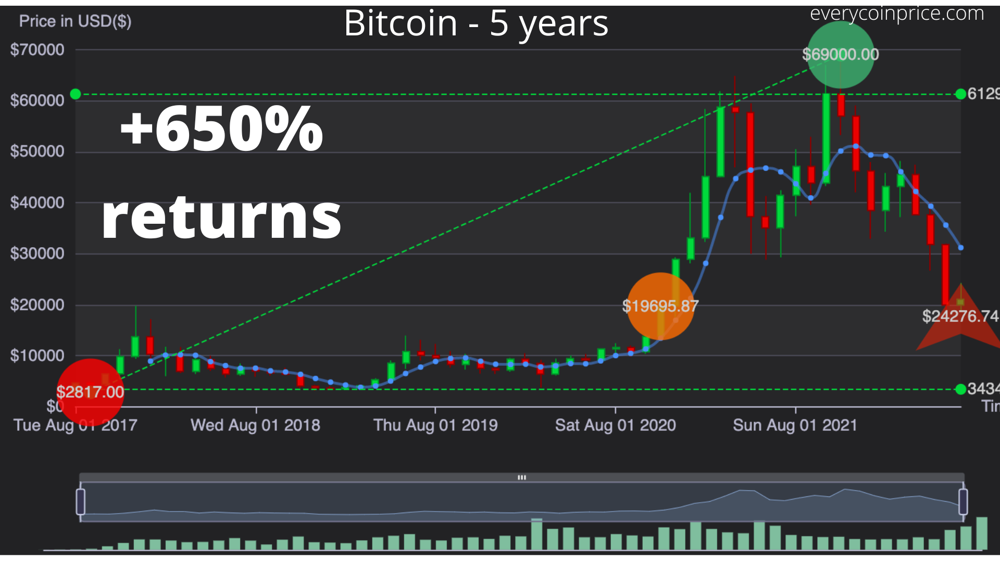
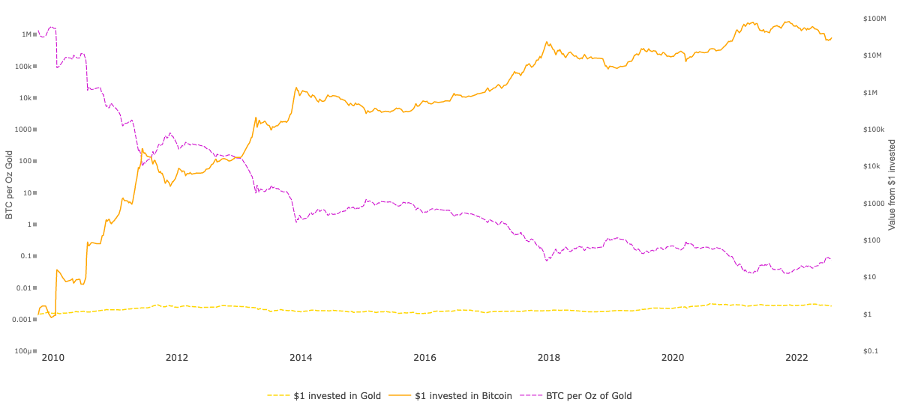
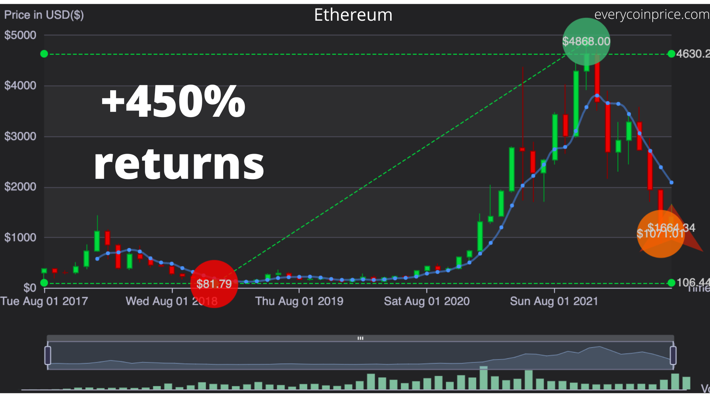
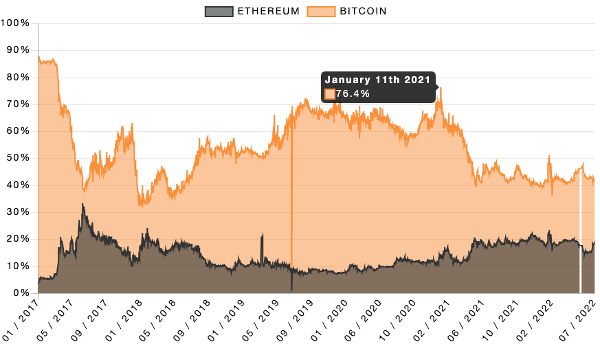

Bitcoin returns have ranged from +650% to more than +1000% in the past 5 years.

[Chart link](https://everycoinprice.com/?symbol=BTC&interval=5years&exchange=0)

### Bitcoin vs Gold

Here is a comparison of $1 invested in Gold vs $1 invested in Bitcoin, in 2010.

[Credit](https://charts.woobull.com/bitcoin-vs-gold/)

As we can see $1 invested in Bitcoin on November, 2009 would be worth $27,674 in November, 2022
and $1 invested in Gold in Novemeber, 2009 would be worth $1.65 in November, 2022

### Bitcoin vs Ethereum

Here is a chart showing Ethereum returns in the past 5 years

[Source](https://everycoinprice.com/?symbol=ETH&interval=5years&exchange=0)

As  we can see Ethereum returns were 450% to +1500% in the past 5 years

Comparison of Bitcoin vs Ethereum market share

[Credit](https://www.buybitcoinworldwide.com/flippening/)

As we can see, Bitcoin have had more market share than Ethereum from the beginning of Cryptocurrency adoption. Bitcoin being the first cryptocurrency. Early entry could be the reason of Bitcoin dominating the market currently

Want to compare Bitcoin with other assets as well? Send us a [Message](mailto:info@everycoinprice.com)