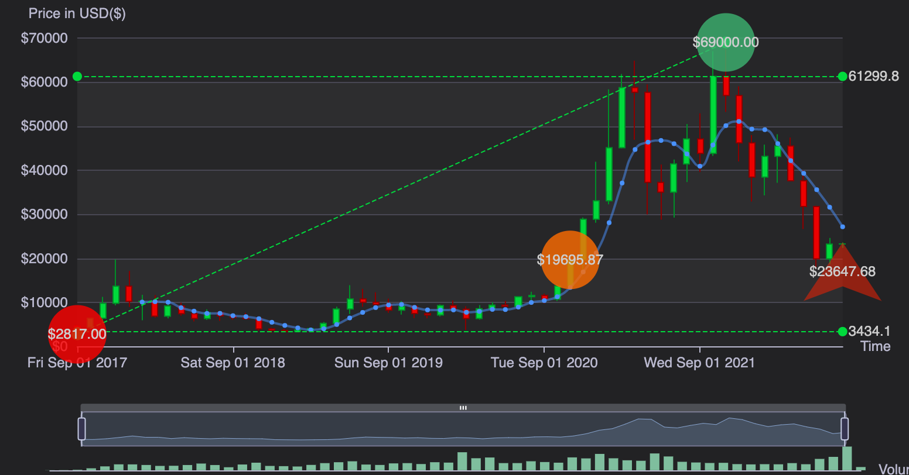
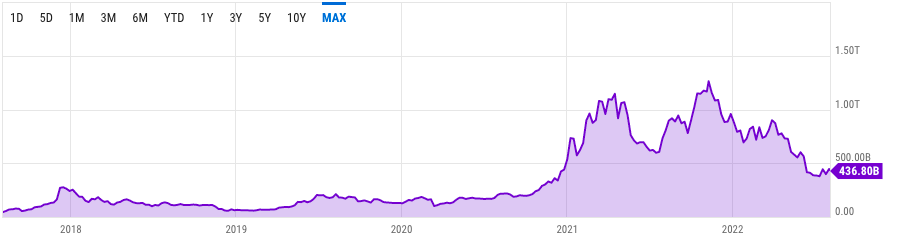
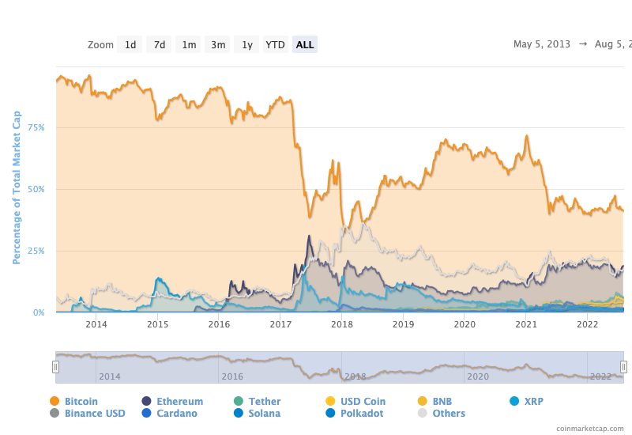

# Bitcoin statistics

## All Time High

Bitcoin hit it's all time high of $69,000 in November, 2021

[Credit](https://everycoinprice.com/?symbol=BTC&interval=5years)

## Market cap

Bitcoin market cap reached a $1 Trillion in April, 2021 which dipped in May,2021 only to surpass $1 Trillion again in November, 2021. The same month when it hit it's all time high of $69,000. It's present market cap has dipped to close to $500M in mid-2022

[Credit](https://ycharts.com/indicators/bitcoin_market_cap)

## Market dominance

Bitcoin market dominance has ranged from 80% in early 2013 to 45% in mid-2022

[Credit](https://coinmarketcap.com/charts/)

