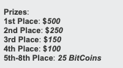

# Bitcoin statistics

Bitcoin has been around since 2009. Bitcoin software was released in January, 2009 and The first block was mined on [January 9, 2009](https://blog.everycoinprice.com/100-facts-bitcoin/#first-version-of-bitcoin-was-released-in-2009).

 First Bitcoin transaction was initiated by Hal Finney on Januar 12, 2009. The value of the transaction was [10 BTC](https://blog.everycoinprice.com/100-facts-bitcoin/#first-transaction-was-received-by-hal-finney)

Here we compiled a list of Top 101 Bitcoin statistics that shook the world

Let's check out the complete list

## Top Statistics (Editor's picks)

* If you had invested $1 in Bitcoin in 2009, You would have **$250,000** now

* **3500** Bitcoins are generated every day

* Largest transaction in Bitcoin has been **500,000 BTC** sent in 2011

* Bitcoin miner's collectively make **$30 million every day**

* StarCraft Tournament awarded 25 Bitcoins to a user who came 4th in the game, in 2011. First prize was $500. 25 Bitcoins are worth **$650,000** today

* 85.77% of all bitcoin holders are Men 

* Bitcoin's trading volume averages at **$100 billion** per day

* **200,000** transactions happen every day on the Bitcoin network

* Year *2140* is predicted to be the last year to mine bitcoins

* Binance remains the most preferred Bitcoin exchange with average of **$14 Billion** worth of trades happen every day through the platform

* El Salvador and Central African Republic have both made Bitcoin a legal tender

* Bitcoin addresses have reached the **1 Billion** address in count, in 2022

* India has the most Bitcoin holders at over **10 million active addresses** while US tops the list of country with the maximum Bitcoin holding

## Is Bitcoin a good investment?

#### Bitcoin vs Gold

If you had invested $1 in Bitcoin and $1 in Gold in October, 2009. You would have made $391,039 in Bitcoin and $1.45 in gold

#### Bitcoin vs S&P 500 

Bitcoin outperformed S&P 500 by around +350,000% in the past 10 years. So, Long-term Bitcoin profits vastly outshines the stock market at the moment

#### Big Tech investments

Big tech companies like Alphabet, the parent company of google have reportedly invested $1.5 Billion in Bitcoin and Blockchain companies. In 2021, Alphabet invested $1 Billion in a Bitcoin Futures provider company, CME group. Blackrock being the second biggest investor. Morgan Stanley being the third and so forth

#### Bitcoin trading volume

Bitcoin trading volume was $250 Million in mid - 2022

#### Bitcoin users age

25-34 age group makes the biggest chunk of Bitcoin investors at 41.35% of the total bitcoin user group

#### Americans usage stat

46 Million Americans (22% of the working population) own 1 or more satoshi( Satoshi being a denominator of BTC - Bitcoin )

#### Search trends

Bitcoin searches peaked during December, 2017

#### New coins

An average of more than 3500 Bitcoins are mined every day

#### Largest Bitcoin transaction

The largest transaction in Bitcoin is 500,000.00 BTC sent in 2011 in a single transaction. Thia transaction could be found on the [blockchain](https://www.blockchain.com/btc/tx/29a3efd3ef04f9153d47a990bd7b048a4b2d213daaa5fb8ed670fb85f13bdbcf)

## How long it takes to mine 1 Bitcoin?

It takes an average of 10 minutes to mine 1 Bitcoin. But, this is true if Bitcoin mining is performed using a Application Specific Integrated Circuit or ASIC. It takes average of 3000 days to generate 1 Bitcoin in Mid - 2022. Current block reward for mining bitcoin is 6.25 BTC to find a single block, which equals $150,000 to $350,000 based on Bitcoin price at the time of mining. Foundrydigital is the most profitable mining pool in 2022 with combined hashrate of 51.8 EH/s. F2Pool being the second at 34.38 Eh/s. Bitmain Antminer S19 XP is the most profitable ASIC to mine Bitcoin at the moment with a profit of around $6 in 24 hours of mining on a single machine

Sources: [Whattomine](https://whattomine.com/coins/1-btc-sha-256), [Miningpoolstats](https://miningpoolstats.stream/bitcoin), [Whattomine](https://whattomine.com/miners/170-bitmain-antminer-s19-xp)

#### Mining Pool

[F2Pool](https://www.f2pool.com/) mining pool has mined the most known bitcoins since the beginning, having mined 72,572 blocks since its inception

#### Miner's Revenue

Bitcoin miner's revenue averaged $30 Million per day in Mid - 2022

#### First block mined

The first bitcoin block was mined 4,974 days ago on 3rd January, 2009

## Is Bitcoin eco friendly?

#### Bitcoin energy consumption - Yearly

Bitcoin energy consumption has been minimum 60 TWh till mid - 2022

#### Energy consumption - Bitcoin vs VISA

A single Bitcoin transaction consumes 2188.59 kWh of Energy

We now compare it with 100,000 VISA transactions

#### Bitcoin energy consumption compared

If Bitcoin was a country, It would consume 146.17 TWh of energy per year and rank as 27th in the list of conutries by energy consumption.

Here we see Bitcoin energy consumption compared with the rest of the world

#### Bitcoin's carbon footprint

The carbon footprint of Bitcoin's network is estimated at 557.76 gCO2/kWh.

This number increased significantly after China Crypto ban in 2021. As miners who had access to large renewable resources moved to other countries like US and Kazakhstan after the ban and mainly rely on coal now as the energy source.

## How many bitcoins are left?

There are 19.1 Million Bitcoins in circulation as of 2022. That means around 1.9 Million Bitcoins are still left to be mined. Rest all of the 19.1 M Bitcoins are in circulations and available to buy and sell for any person using popular bitcoin exchanges like [Binance](https://accounts.binance.com/en/register?ref=Y13AR2AJ) or using P2P trading.

Source: [Everycoinprice](https://everycoinprice.com/?symbol=BTC&interval=1day)

## How can i get bitcoin for free?

#### Largest Casino Win

A person named Nakowa won 11,000 Bitcoins from a Bitcoin Casino. It was worth about 1.3 million US Dollars at the time but now it is worth more than 230 Million USD.

#### Biggest bitcoin giveaway

A StarCraft gaming tournament took place 11 years ago and the 5th till 8th place winners were awarded **25 bitcoins** in Feb, 2011. 
25 Bitcoins are worth over half a million today in US dollars. It will be worh $650,000 today

Thr first prize was $500

#### Donation to Wikileaks

The 4000th Bitcoin was donated to Wikileaks from December 2016

## What is the minimum amount to invest in Bitcoin?

At the time of writing this article, the price of 1 [Bitcoin](https://everycoinprice.com/?symbol=BTC) is $22,000. There are 100,000,000 Satoshis in 1 Bitcoin. The smallest unit of Bitcoin is 1 satoshi which could be bought for **$0.00022** in 2022.

## Who owns the most bitcoins?

#### Richest Bitcoin billionaire

The richest HODLer in Bitcoin holds 252,597 BTC as of August, 2022 that is 0.12% of the total supply of 20 million Bitcoins. The wallet has been active since October, 2018

#### Number of Holders

As of August, 2022, 895,673 users around the world own 1 or more Bitcoins. That is more than 2% of all Bitcoin users. Rest 88% hold between 0 to 1 Bitcoin (BTC), who are estimated at 42,185,302 users globally. Total Number of Bitcoin holders are estimated at 43,080,975 users or 43 Million BTC holders. This is calculated based on number of active BTC addresses.

#### Companies by their Bitcoin Holdings

Microstrategy owns the maximum number of Bitcoins, followed by Tesla

#### Founder's wallet

Bitcoin's founder Satoshi Nakamoto holds 1 million bitcoin and left the rest of 20 million Bitcoins to be mined since its inception in 2009

#### Bitcoin users by gender

85.77% of all bitcoin holders are Men and 14.23% are women

## How much does Bitcoin costs?

Bitcoin costs different every single day as the price is fluctuating. You can check the latest bitcoin price on [Everycoinprice](https://everycoinprice.com)

## What happens when Bitcoin hits zero?

Bitcoin's demand is to be set to zero if Bitcoin was to be traded at $0. But due to the increase in demand and supply. Bitcoin's network seems to be on an increase in network activity over the past decade. Same goes for the trading volume of Bitcoin, which was at $100 billion per day in 2022. Statistically, Bitcoin is unlikely to be hitting $0 in the near future.

#### Trading volume

Bitcoin trading volume was around $100 Billion per day in mid - 2022

#### Wallets created

[Blockchain](https://blockchain.com) saw about 80 bitcoin wallets generated per day on their crypto wallet service website. The biggest jump came in 2020, as we can see from the chart

#### Bitcoin Hashrate

Bitcoin network hashrate is 200 Million TH/s in mid-2022

## Can i sell my Bitcoins?

Yes, You can sell bitcoins using exchanges or P2P trading

#### Transactions per day

Bitcoin transactions reached 200,000 per day in mid - 2022. 
Average of 5 Bitcoin transactions happer every second

#### Transaction Confirmation Time

Bitcoin median transaction confirmation time averages 10 minutes in mid - 2022

## Will Bitcoin ever run out?

Bitcoin's supply is capped at 21 Million. So once all of the 1.9 Million left bitcoins have been mined. Then there we will run out of Bitcoins to mine but all 21 Million Bitcoins will be in circulation at that point in time, available for all of us to trade with.

#### Last year of Bitcoin mining 

Year 2140 is predicted to be the year when the Bitcoin mining will end. This is when all 21 million Bitcoins would have been mined

## How long does it take to make money from Bitcoin?

### Bitcoin performance (10 years)

Bitcoin's performance as asset outperformed the biggest stocks like Tesla and Apple in the past 10 years. Returning +569,777% returns in 10 years to its investors

All compared

#### Holding time

Average Bitcoin holding time is 3.4 years in 2022 that means that an average investor waits 3.4 years before selling their Bitcoins

## How do i purchase a Bitcoin?

There are multiple ways to buy and sell Bitcoin but the method preferred by most is through exchanges

Here we rank the top Bitcoin/Crypto Exchanges online

#### Top 10 Crypto Exchanges

Binance has emerged as the most preferred exchange for buying and selling Bitcoin and other cryptocurrencies. It tops in the volume of Crypto trading in US dollars every day(24 hours)

## Is Bitcoin legal or illegal?

#### Bitcoin as legal tender

2 Countries where Bitcoin is accepted as a legal tender are-

* El Salvador
* Central African Republic

That means you can buy and sell items using Bitcoin in these countries. As they are accepted as legal currencies for trade here.

#### Bitcoin ATMs world comparison

United states leads the world ranking by installing maximum number of Bitcoin ATMs, compared globally. This puts the world total to 850 active Bitcoin ATMs

Geo-Map for Countries vs Number of ATMs

#### Countries where Bitcoin is banned

9 countries have banned Bitcoin 

* Egypt 
* Iraq
* Qatar
* Oman
* Morocco
* Algeria
* Tunisia
* Bangladesh
* China

## Which countries uses bitcoin?

#### Bitcoin adoption by country

According to UN, Ukraine has the largest adoption of cryptocurrencies like Bitcoin. Where more than 12.7% of the population own atleast any of the thousands of cryptocurrencies available online. While, In 2022, At least 8.3% of Americans owns digital currencies

| Country                  | Population that owns digital currencies |
|--------------------------|-----------------------------------------|
| Ukraine                  | 12.7%                                   |
| Russia                   | 11.9%                                   |
| Venezula                 | 10.3%                                   |
| Singapore                | 9.4%                                    |
| Kenya                    | 8.5%                                    |
| United States of America | 8.3%                                    |
| India                    | 7.3%                                    |
| South Africa             | 7.1%                                    |
| Nigeria                  | 6.3%                                    |

#### Adoption rate

Bitcoin is being adopted faster than the internet where we have reached 1 Billion Bitcoin addresses generated in July, 2022. 
The adoption rate being highest in 2017, when Bitcoin address generation rate climbed to 80% growth in 2017 which was very high compared to internet's growth of 16.6%, the same year.

#### Ranking countries based on Crypto trades

Vietnam is the most active in trading/sending/receiving cryptoassets as ranked by [Chainanalysis](https://blog.chainalysis.com/reports/2021-global-crypto-adoption-index/)

| Country       | Trade Score |
|---------------|-------------|
| Vietnam       | 1           |
| India         | 0.37        |
| Pakistan      | 0.36        |
| Ukraine       | 0.29        |
| Kenya         | 0.28        |
| Nigeria       | 0.26        |
| Venezuela     | 0.25        |
| United States | 0.22        |
| Togo          | 0.19        |

#### Canada's role in Bitcoin's network

Canada alone can produce clean hydroelectricity with a capacity of over 400 TWh

The entire Bitcoin network uses just 129 TWh of energy today. That means Canada alone can run the entire Bitcoin network with clean and green sustainable energy

## What is the adoption rate of Bitcoin?

#### Bitcoin adoption

1 billion people will be using bitcoin in the next 4 years. Based on the current state of adoption

#### 1 Billion bitcoin addresses

Bitcoin reached 1 Billion addresses in August, 2022. Addresses are like wallets to store, send and receive bitcoins from

#### Countries optimism about the future

Countries most optimistic about the future of Bitcoin are ranked below

| Country        | Optimism |
| -------        | -------- |
| Nigeria        |    60%   |
| India          |    58%   |
| Vietnam        |    56%   |
| Argentina      |    55%   |
| South Africa   |    52%   |
| China          |    36%   |
| United States  |    29%   |
| Australia      |    28%   |
| Italy          |    25%   |
| United Kingdom |    25%   |
| France         |    23%   |
| Germany        |    22%   |
| Canada         |    21%   |
| Japan          |    11%   |

Nigeria being the most optimistic at 60% population positive about the future of Bitcoin

#### If Bitcoin was a country

By number of users, if Bitcoin was a country, it will be the 14th largest country by population size

#### Bitcoin settlements in 2021

Bitcoin network settled $62 trillion worth of bitcoin in 2021, which is 3 times the GDP of United States

#### Bitcoin user device preferences

76% of Bitcoin users are Desktop users, while 20.88% users are Mobile users and rest 3.12% users are tablet users.

#### Ranking countries by Bitcoin owners

India tops the list with over 10 Million bitcoin holders which is 7.3% of the population

## Bonus

#### All Time High

Bitcoin hit it's all time high of $69,000 in November, 2021

[Everycoinprice](https://everycoinprice.com/?symbol=BTC&interval=5years)

#### Market cap

Bitcoin market cap reached a $1 Trillion in April, 2021 which dipped in May,2021 only to surpass $1 Trillion again in November, 2021. The same month when it hit it's all time high of $69,000. It's present market cap has dipped to close to $500M in mid-2022

#### Market dominance

Bitcoin market dominance has ranged from 80% in early 2013 to 41% in mid-2022

#### Blockchain Size

The size of bitcoin blockchain is 405 GigaByte(GB) in July, 2022

#### Transaction fees

Bitcoin transaction fees ranged around $1-$2 per transaction in mid - 2022

#### Blockchain size

Bitcoin blockchain size is 434.05 GB with 749,822 blocks mined

Sources: [Coinmarketcap](https://coinmarketcap.com/charts/), [Statista](https://www.statista.com/statistics/647523/worldwide-bitcoin-blockchain-size/), [Blockchain](https://www.blockchain.com/charts/n-transactions), [Blockchain](https://www.blockchain.com/charts/trade-volume), [Blockchain](https://www.blockchain.com/charts/fees-usd-per-transaction), [digiconomist](https://digiconomist.net/bitcoin-energy-consumption), [digiconomist](https://digiconomist.net/bitcoin-energy-consumption), [Statista](https://www.statista.com/chart/7566/number-of-bitcoin-atms-by-country/), [Statista](https://www.statista.com/chart/27575/public-companies-with-most-bitcoins-on-balance-sheet/), [Google](https://trends.google.com/trends/explore?date=all&q=bitcoin), [Blockchain](https://www.blockchain.com/charts/miners-revenue), [Bitinfocharts](https://bitinfocharts.com/top-100-richest-bitcoin-addresses.html), [Bitinfocharts](https://bitinfocharts.com/bitcoin/address/34xp4vRoCGJym3xR7yCVPFHoCNxv4Twseo), [Bitcoinity](https://data.bitcoinity.org/markets/volume/all?c=e&t=b), [BTC](https://explorer.btc.com/stats/pool), [Nasdaq](https://data.nasdaq.com/data/BCHAIN/ATRCT-bitcoin-median-transaction-confirmation-time), [Blockchain](https://www.blockchain.com/charts/hash-rate), [Coindesk](https://www.coindesk.com/price/bitcoin/), [Coindance](https://coin.dance/stats), [Coinmarketcap](https://coinmarketcap.com/legal-tender-countries/), [Statista](https://www.statista.com/statistics/647374/worldwide-blockchain-wallet-users/), [Woobull](https://charts.woobull.com/bitcoin-vs-gold/), [Nasdaq](https://www.nasdaq.com/articles/bitcoin-vastly-outperformed-gold-and-sp-500-over-the-past-decade), [Cryptopotato](https://cryptopotato.com/google-invests-1b-in-bitcoin-futures-provider-cme-group/), [Bitcoinist](https://bitcoinist.com/google-invested-1-billion-crypto-focused-companies/), [Bitcoinist](https://bitcoinist.com/google-analytics-bitcoin-demographics/), [Documenting Bitcoin](https://twitter.com/DocumentingBTC), [StarCraft tournament](https://tl.net/forum/bw-tournaments/190866-aov-iccup-starleague), [Chainanalysis](https://blog.chainalysis.com/reports/2021-global-crypto-adoption-index/), [BitcoinTalk](https://bitcointalk.org/index.php?topic=5046765.0), [BitcoinTalk 2](https://bitcointalk.org/index.php?topic=3223653.0), [c-sharpcorner](https://www.c-sharpcorner.com/article/top-10-countries-with-the-most-cryptocurrency-holders/), [Coinmarketcap](https://coinmarketcap.com/rankings/exchanges/)